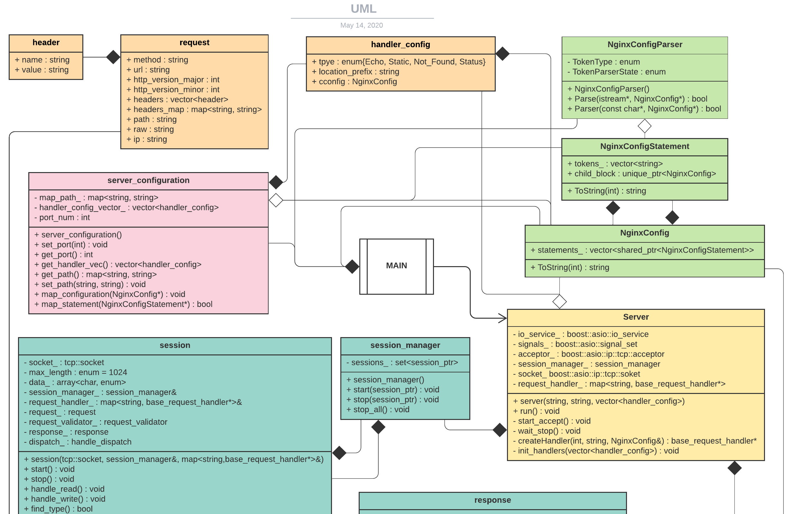
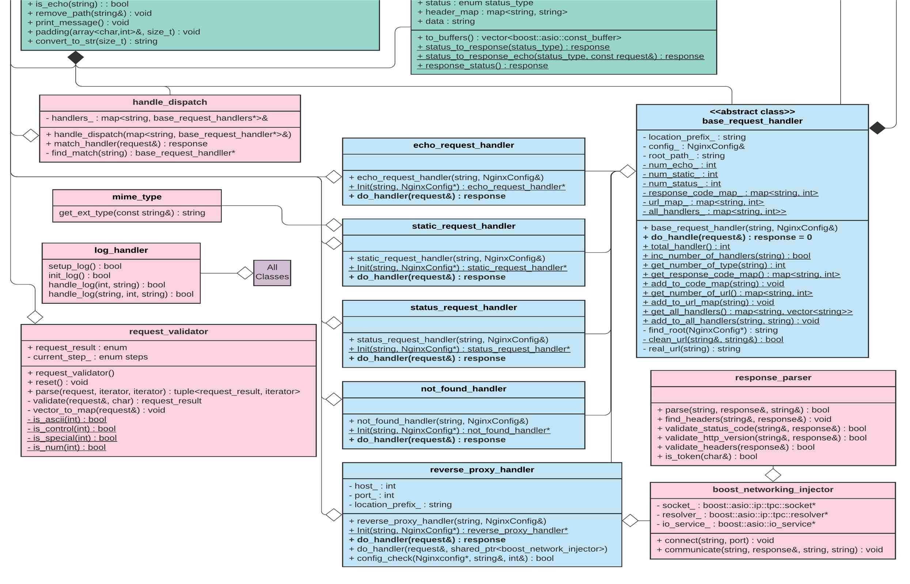

# Gerrit Masters

## How to add a request handler

### Init function
Users can create EchoHandler, StaticHandler, and StatusHandler based on the configuration files.

`base_request_handler* echo_request_handler::Init(std::string location_prefix, NginxConfig &config)` 

`base_request_handler* static_request_handler::Init(std::string location_prefix, NginxConfig &config)`

`base_request_handler* status_request_handler::Init(std::string location_prefix, NginxConfig &config)`

Users can create the echo, static, and status request handler that takes the location_prefix like `”/echo”` and NginxConfig object, which is the child of the NginxConfig object that starts with location.

For example,
```
http {
    server {
        port 80;
        
        location "/echo" EchoHandler {
            root "../data/echo_data";
        }

        location "/static" StaticHandler{
            root "../data/static_data";
        }    

        location "/status" StatusHandler{
        }    
    }
}
```

The Init functions of request handlers take NginxConfig like `root “../data/static_data”` as argument or take the empty NginxConfig.

### handle_config

In order to store the information we get from the configuration file, we decided to create a data structure called `handle_config`
```cpp
struct handler_config {
    enum {Echo=1, Static=2, Not_found=3, Status=4} type;
    std::string location_prefix;
    NginxConfig config;
};
```
When the configuration file is parsed, we create a vector of handler_config and send it to the server when created.


### Create request handlers

1. When a server is created in the `server_main.cc`, the server’s constructor calls the function 

`void server::init_handlers(std::vector<handler_config> handler_list)`

2. This function iterates the vector and call 

`base_request_handler* server::createHandler(int type, std::string location_prefix, NginxConfig &config)`

3. This calls the `Init` functions to create the request handlers

4. Store the location prefix that maps to the corresponding handlers for later use to bring the right handlers when dispatching the handlers


## How to build, test, and run the code

### build
Our code uses cmake to manage the build process of the project for compiler-independency. After downloading the repository, you can create a directory to build and run the code. Then run cmake to create Makefile and use the Makefile to completely build the code.

`mkdir build`

`cd build`

`cmake ..`

`make`

### run
After building/compiling the code, it will create the `/bin` directory that contains the server executable file. You can run the executable with a configuration file as an argument to create the server. For example,

`bin/server ../tests/config_test` 

will run on the local machine with port number 8080 and other information about the server.


### test
In order to run the test cases for the code, you have to build the code with the coverage option.

`mkdir build_coverage`

`cd build_coverage`

`cmake -DCMAKE_BUILD_TYPE=Coverage ..`

`make coverage`

This will automatically build/compile and run the test cases that are in `./tests`.

Running `make coverage` will generate a coverage report to see how much of the code is covered by the tests.


---


---
# Status Handler:
Our status handler is a pretty simple setup, and mainly consists of 3 parts. The 3 locations that play the main roles for handling this status handler can be found in base_request_handler, status_request_handler, make_response.
## 1. base_request_handler
For echo_handling, all base_request_handler does is keep track of different requests that are handled using private data members, and the getter and setter functions for each of these private data members.
Simply put, the followings are the private data members used in base_request_handler, and there exists a getter and setter function for each of these data members.
```cpp
int num_echo;  // keeps track of the number of echo requests
int num_static; // keeps track of the number of static requests
int num_status; // keeps track of the number of status requests
int num_not_found; // keeps track of the number of not_found requests
std::map<std::string, int> response_code_map;  // maps response_code (eg “404”, “200”), to the number of occurrences
std::map<std::string, int> url_map; // maps url (eg static/index.html) to the number of occurrences
std::map<std::string,std::vector<std::string>> all_handlers; // maps handler names (eg EchoHandler) to a vector of paths it is configured to (eg “../data/echo_data”)
```
## 2. status_request_handler
In short, do_handle is the function that takes in a request, and returns a formatted response.   
A formatted response consists of the response code (typically 200 for “OK”) and the created response message body. The message body creation part is handled by make_response. Also within this function, we use the functions from the previous paragraph to increment the number of times status request was made, and the number of times the specific return code was made.
## 3. Make_response
In short, response_status is a function that takes no parameters, and returns a formatted message that gives information on the requests made to the server.
The response is structured using header_map, which includes the information about the message being sent back (such as content type and content length), response code, and the message itself. Message is formatted in a HTML format.

---

# Static Handler:
Static handler is the most complicated handler within the four handlers. This handler takes in a request, and outputs a response.     
In short, by using the prefix given by the server configuration file along with the url of the request, the static handler tries to find a file, and if it does, it will return that file. Else, it will ask the not found handler to handle the situation.
Two main source files for implementing the Static Handler are static_request_handler, and make_response.
## 1. Static_request_handler
In short, static_request_handler takes in a formatted request, and returns a suitable formatted response based on the provided url in the request.  
In static_request_handler, there is a function called do_handle, that basically takes care of what to do with the given request. Our do_handle first checks the validity of the given url (eg valid url? Are they not breaking the format rules for path? etc..).  
Then, it will concatenate with the root path given in the server configuration file. Using this new path, it will try to traverse to check if the requested file exists.  
If any of these requirements do not pass, do_handle() will pass the request down to the status_to_response function in make_response with their respective messages.    
However, if all requirements pass, do_handle will read the requested file, and copy that into the message portion of the response.
Once the response is made, we keep track of the type of requests that were made, and return the newly made formatted response.
## 2. Make_response
In short, status_to_response will be called if somehow static_request_handler’s was not able to return the requested file (eg invalid url, file doesn’t exist, etc..).  
Status_to_response is a function that takes in a status_type(eg not_found, bad_request) to create a message that needs to be sent back to the client and returns that to the do_handle of static_request_handler.

---

# Echo Handler:
In short, this is a simpler version of static_request_handler. Instead of returning the file when the request is valid, it will echo back the request.
## 1. echo_request_handler 
The do_handle in echo_request_handler is a simpler version of the previous static_request_handler’s do_handle.   
This do_handle takes in a request, then checks if the file can be accessed with the path provided, similar to the way static_request_handler works. It will act the same if there is something wrong with the request and pass the request on to status_to_response along with the response_type to generate the response going out.   
However, instead of reading through the file when found, do_handle will duplicate the original request as the returning response’s message body using status_to_response_echo inside make_response.  
## 2. make_response
In short, status_to_response gets called when there are some errors within the echo request, and status_to_response_echo will be called if successful. Status_to_response works as explained in the static_request_handler portion. Status_to_response_echo works very similarly to the previous function, but instead of creating a message on why the request failed, it will echo back the original request. 

---

# Not Found Handler
This is also another very simple handler, and is far more simpler than the previous handler as well. This handler is called when the requested handler does not exist, basically acting like a default handler for requests.  
## 1. not_found_handler
This do_handle takes in a request, and returns a pre-structured message claiming that the request cannot be found, causing 404 error.

---

# Header File Descriptions
[Header File Readme](/include/README.md)
